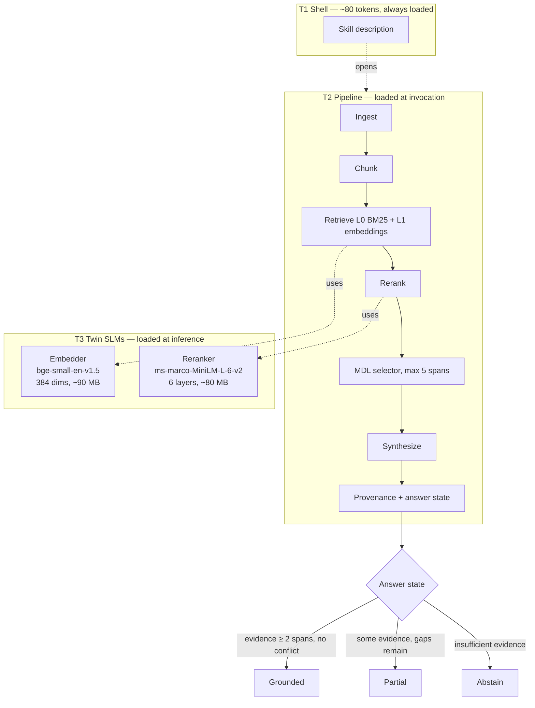

# Grounded RAG: An Army Inside Eighty Tokens

**A repo-scoped, evidence-backed answering skill that runs entirely offline**

---

- **Version:** 1.0
- **Date:** May 2026
- **Author:** Jonathan A. Bowe
- **Classification:** Marketing White Paper (Companion to Grounded RAG v1 Technical White Paper)

---

## 1. From the outside, 80 tokens. Inside, an army.

Grounded RAG is a single Claude Code skill whose description fits inside roughly eighty tokens. A session that never asks it a question pays almost nothing for its existence. A session that does asks it a question opens the doll.

Inside the first shell is a complete retrieval pipeline. Inside that pipeline are two small language models, both local, both encoder-only, both running on the developer's machine without a network call. Around all of it sits a governance layer that decides when an answer is grounded, when it is only partial, and when the honest reply is to abstain.

The name came out of a 128-seed single-elimination tournament. Matryoshka beat Leviathan, Reliquary, Tesseract, and then Ark in the final to take the name. The metaphor stuck because it describes the architecture: a small surface object that contains progressively richer machinery the deeper you look.

This paper is the short version. A longer technical companion paper covers the formal definitions, the Dempster-Shafer math, and the open questions. If a claim here sounds interesting and you want the proof, follow the link at the end of section 4.

---

## 2. The problem Grounded RAG was built for

### Tool descriptions have become a budget line

Anthropic's own engineering guidance reports accuracy degradation once an agent session loads more than thirty to fifty tools, and severe degradation past one hundred. A modern gateway routing twenty or more MCP servers can spend roughly thirty thousand tokens of context purely on tool definitions before the user has said anything.

Every skill that wants to be discoverable has to pay rent in that budget. Most skills pay too much. They publish a long description because they want to be picked, and the cost of being picked is borne by every session that never invokes them.

### RAG ships as a scaffold, not a system

Most retrieval-augmented generation stacks arrive as a kit. The team gets a vector store from one vendor, an embedding API from another, a reranker from a third, and a synthesis prompt to assemble themselves. Each part is solvable; the integration is the work, and the integration is where reliability disappears.

The result is a class of systems that look right on the demo and fail quietly in production. The failures are recognizable: chunks ranked by cosine similarity that turn out to be eighteen months stale, citations that point at files the user can no longer find, answers that cannot be replayed when somebody asks how the system got there.

### Confident answers without a way to check

The deepest problem is epistemic. A standard RAG answer asserts a conclusion with a list of citations attached. The reader has no way to tell whether the citations actually support the conclusion, whether the underlying source has since changed, or whether the system would have admitted uncertainty if it could.

Grounded RAG exists because design-phase honesty is cheaper than production-phase regret. The system is built to know what it does not know, to say so plainly, and to make every non-abstaining answer replayable against the exact corpus state that produced it.

---

## 3. Opening the doll

The architecture has three layers. Each layer is small enough to describe in a paragraph. Together they hold the design thesis: *a single skill that contains an entire RAG pipeline plus two small language model roles*.

### T1: the shell

The outer doll is the skill description that Claude Code's tool registry sees. It is targeted at a contract maximum of eighty tokens. Following the progressive disclosure tiers documented in Aegis Drop ADR-004, T1 is the only payload that always loads; T2 (the pipeline) loads at invocation, and T3 (the models) loads at inference time.

The number is a contract ceiling, not a measured value — no Grounded RAG SKILL.md exists yet. But the architectural commitment is real: the cost of discovery is bounded, and the cost of invocation is paid only by sessions that actually invoke.

### T2: the pipeline

Open the shell and the second doll holds a complete retrieval pipeline. Ingestion reads the target repository's source files, markdown, ADRs, and design documents. Chunking produces source-anchored spans. A two-layer index — BM25 over raw tokens plus 384-dimensional statement embeddings — answers retrieval queries. A reranker scores the candidates. A Minimum Description Length selector chooses the final span set under a hard ceiling of five primary spans. Synthesis emits an answer with full provenance attached.

The live serving path is exactly five steps. Everything else — claim extraction, contradiction consolidation, benchmark generation, compaction — runs offline. The split is deliberate: a narrow hot path is easier to test, easier to debug, and closer to the simple baseline the system must beat.

### T3: the twin SLMs

Open the pipeline and the inner doll holds two language models. The embedder is `BAAI/bge-small-en-v1.5`, 33.4 million parameters, 384-dimensional output, MIT-licensed. The reranker is `cross-encoder/ms-marco-MiniLM-L-6-v2`, a six-layer cross-encoder that scores query-document pairs jointly. Both run through `sentence-transformers` on the local machine.

First-run initialization downloads roughly 170 MB of model weights. After that download, inference is fully offline. There is no API call, no gateway dependency, no daemon process. Air-gapped operators can pre-stage the weights manually.

The thesis sits at the bottom of the doll: a single skill that contains an entire RAG pipeline plus two small language model roles. The architecture is the message.

---

## 4. Where to go next

This paper is the entry point. The full case lives elsewhere.

- **Engineers** who want the formal definitions, the Dempster-Shafer combination rules, the bitemporal identity tuple, the seven core invariants, and the open architectural questions should read the **technical companion paper** at [`grounded-rag-v1-technical.md`](./grounded-rag-v1-technical.md).
- **Operators** who want to know how Grounded RAG deploys, attests, and revokes in production should read about **Aegis Drop**, the sister system. Grounded RAG answers from evidence; Aegis Drop deploys, attests, and revokes.

The two systems are deliberately separate. A skill that can also deploy itself couples epistemic correctness to service mesh concerns in the same failure domain. Keeping them apart is a discipline, not a convenience.

---

## 5. Architecture at a glance

### What each layer contributes

| Layer | Component | Contribution | Status |
|-------|-----------|--------------|--------|
| T1 | Skill description | Discoverability at bounded token cost | Contract maximum of 80 tokens |
| T2 | Five-step pipeline | Ingest, retrieve, rerank, select, synthesize | Designed; no implementation yet |
| T2 | Provenance ledger | Hash-linked chain from source to answer | Schema defined; emission deferred to Track D |
| T3 | Embedder + reranker | Local, encoder-only, ~170 MB total | Models selected; not yet integrated |
| T3 | Governance layer | Three-state answer contract; Boring Mode fallback | Designed; circuit breakers in Track G |

### Open framing — read this before extrapolating

The system is design-phase. No benchmarks have been run. No SKILL.md exists. The live-path synthesis step is under design — the technical paper §10.1 covers the open question of which model performs synthesis. Track H, the Aegis Drop release interface, is deferred to post-v1; v1 ships a stub of the BehavioralCertificate schema only.

These open questions are part of the design's honesty, not gaps the marketing version is hiding. The technical paper treats each in depth.

---

## 6. What the source documents say

Three lines from the design corpus carry most of the weight of this paper. Each is quoted from its source file.

> "Grounded RAG must function without any external API calls, network services, or running daemons at inference time. This constraint cannot be traded off against any lower-priority objective in the hierarchy."
>
> — ADR-011, *Runtime Self-Containment as Hard Constraint* (`docs/ADR.md:527-532`)

> "No answer is served without anchored evidence unless it is an explicit abstention."
>
> — Core Invariant 1, *Constitution* (`docs/constitution.md:38-50`)

> "The v1 architecture fails if grounded answer usefulness is not at least 15% better than the required baseline after the first serious prototype."
>
> — Primary kill criterion, *v1 Scope* (`docs/v1-scope.md:213-220`)

The first line is the architectural floor: the system runs offline or it does not run. The second is the epistemic floor: an answer without evidence is not an answer, it is an abstention dressed up. The third is the falsifiability floor: a fifteen percent improvement over a simple BM25 baseline is the bar Grounded RAG is committing to be measured against, not a result it claims to have produced.

---

## 7. The shorter version

Grounded RAG is a Claude Code skill targeted at clearing the eighty-token T1 contract ceiling. Inside that shell sits a five-step RAG pipeline, two local encoder models, and a governance layer that classifies every answer as Grounded, Partial, or Abstain. The system is designed to run entirely offline after a one-time ~170 MB download. Every non-abstaining answer is designed to be replayable against the exact corpus snapshot that produced it. When source changes, evidence revocation is specified to cascade through the index, and the system is specified to fall back to Boring Mode rather than fail open.

The kill criterion is fifteen percent better than a top-k BM25 baseline on grounded usefulness. No benchmarks have been run yet. The honest version of every claim in this paper carries the same hedge: *designed to*, *specified to*, *targeted at*. The technical companion paper preserves those hedges throughout.

If the design holds, Grounded RAG is a single small object that hides an entire retrieval system, two language models, and an audit trail. From the outside, eighty tokens. Inside, an army.

---

## Further reading

- **Technical companion paper:** [`grounded-rag-v1-technical.md`](./grounded-rag-v1-technical.md) — formal definitions, Dempster-Shafer combination, bitemporal provenance, open questions
- **Constitution:** [`docs/constitution.md`](../constitution.md) — objective hierarchy, core invariants
- **Architecture Decision Records:** [`docs/ADR.md`](../ADR.md) — eleven ADRs covering every load-bearing decision
- **v1 Scope:** [`docs/v1-scope.md`](../v1-scope.md) — what is in, what is out, kill criteria
- **Aegis Drop:** the sister deployment substrate

---
