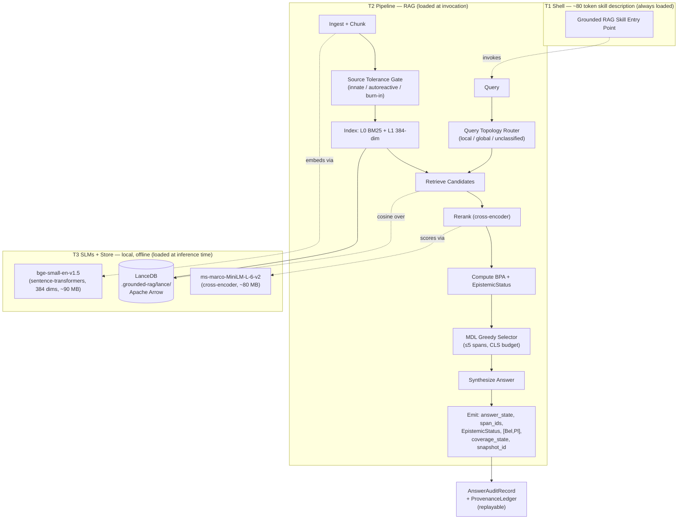

# Grounded RAG v1: A Repo-Scoped, Evidence-Backed Answering Skill

**A nested architecture for offline retrieval-augmented answering with replayable provenance, dialectical conflict tracking, and discrete epistemic states**

---

- **Version:** 1.0
- **Date:** May 2026
- **Author:** Jonathan A. Bowe
- **Classification:** Technical White Paper
- **Status:** Design phase — no implementation, no benchmarks
- **Plugin Version:** Pre-implementation (no SKILL.md yet)

---

## Abstract

This paper presents Grounded RAG, a repo-scoped, evidence-backed answering skill designed to give engineers and maintainers reliable answers about a single codebase while preserving auditability, replayability, and explicit epistemic honesty. The system is named for its nested structure: an outer Claude Code skill shell with a small description, a middle retrieval-augmented generation pipeline, and an inner pair of small encoder-only language models, all bundled inside a single deployable artifact. The design's central thesis is that grounded correctness, replayable provenance, and offline operability can be specified as hard constraints rather than aspirations, and that an answer contract restricted to three discrete states — `Grounded`, `Partial`, and `Abstain` — provides a machine-testable falsifiability surface that float-valued confidence scores do not (`docs/ADR.md:57-108`). Grounded RAG v1 is deliberately constrained to repo-local source files, markdown, ADRs, design documents, and configuration (`docs/ADR.md:167-211`); excludes web crawling, chat logs, and cross-repo memory (`docs/v1-scope.md:9-16`); and frames itself around a smallest falsifiable loop — ingest one repo, answer questions with direct evidence spans, attach replayable traces, outperform a simpler span-RAG baseline by at least 15%, and survive revocation plus degraded-mode fallback (`docs/v1-scope.md:45-55`, `docs/v1-scope.md:213-220`).

The architecture combines a bitemporal evidence model after Jensen and Snodgrass [1], a Dempster-Shafer Basic Probability Assignment over the three-state frame [2], dialectical conflict tracking using Pollock's defeasible reasoning taxonomy [3] and Dung's preferred argumentation semantics [4], and a W3C PROV-DM derivation chain [5] that renders every answer step-by-step reconstructable. Runtime self-containment was elevated to a hard constraint co-equal with grounded correctness in ADR-011 (`docs/ADR.md:509-554`), driving a supersession of the original MorphLLM/gateway plan in favor of local sentence-transformers models and an embedded LanceDB store (`docs/ADR.md:407-458`). Targeted performance figures — including a ~170 MB first-run download budget, a ~10–15% expected corpus churn rate per update, a 40% targeted context reduction relative to flat top-k retrieval, and an 80-token T1 contract ceiling — are design targets drawn from referenced research and contract specifications, not measured outcomes; no benchmarks have been run, and the 15%-better-than-baseline figure is the system's kill criterion rather than a reported result.

## Table of Contents

1. [Introduction](#1-introduction)
2. [Problem Statement](#2-problem-statement)
3. [System Architecture](#3-system-architecture)
4. [Core Contributions](#4-core-contributions)
5. [Workflow and Pipeline](#5-workflow-and-pipeline)
6. [Ecosystem Integration](#6-ecosystem-integration)
7. [Safety, Governance, and Boring Mode](#7-safety-governance-and-boring-mode)
8. [Use Cases](#8-use-cases)
9. [Performance Targets and Kill Criteria](#9-performance-targets-and-kill-criteria)
10. [Architectural Open Questions](#10-architectural-open-questions)
11. [Related Work](#11-related-work)
12. [Conclusion](#12-conclusion)
13. [References](#references)
14. [Appendices](#appendices)

---

## 1. Introduction

Engineering questions about a codebase are often answered by retrieval systems that return semantically plausible chunks of text and a synthesized summary, but rarely by systems that can tell the asker which evidence supported the answer, how confident the system is in the supporting evidence, what it does not know, or which exact corpus snapshot would reproduce the answer days or months later. Standard retrieval-augmented generation (RAG) stacks treat citations as decorative, treat chunks as units of truth, depend on external infrastructure, and are routinely opaque about evolution and drift (`docs/grounded-rag-v1-beads-spec.md:20-32`). Grounded RAG is an attempt to invert each of those defaults: every cited span is anchored to a versioned source location, every answer is one of three discrete states with explicit thresholds, every served answer carries a provenance ledger that can be replayed against a fixed corpus snapshot, and the system runs entirely offline at inference time.

The project takes its name from the Russian nesting doll. From the outside, the artifact appears as a single Claude Code skill with a small description (a contract ceiling of approximately 80 tokens, per the AI Provenance Spec hot-swap specification at `ai-provenance-spec/docs/specs/hot-swap-v1.md`). Inside that shell sits a full RAG pipeline; inside that pipeline sit two embedded small language models — an encoder for embeddings and a cross-encoder for reranking. The metaphor is structural rather than ornamental: each nested layer hides complexity from its parent context until invocation, in line with the progressive-disclosure tier model elevated by AI Provenance Spec's ADR-004 (`ai-provenance-spec/docs/ADR.md:82-97`). The name was chosen through a single-elimination tournament of 128 avatar names, reduced to 32 candidates and then to a 16-team bracket; Matryoshka defeated Leviathan, Reliquary, Tesseract, and finally Ark in the championship round (`docs/backstory.md`).

This paper documents the v1 design — its constitutional invariants, its eleven architecture decision records, its smallest falsifiable loop, and its kill criteria. It surfaces explicitly the one architectural gap the design has not yet closed: the live serving path requires answer synthesis, but the two named models are both encoder-only, and no generative model is named anywhere in the design documentation. Section 10 treats that gap honestly.

### 1.1 Contributions

1. **A three-state answer contract** (`Grounded`, `Partial`, `Abstain`) with explicit, frozen thresholds (`docs/ADR.md:57-108`), providing a machine-testable surface that avoids the calibration problems of single-valued confidence scores.
2. **A canonical `EvidenceSpan` object** with bitemporal identity, hash-linked provenance ledger, Dempster-Shafer Basic Probability Assignment vector, and dialectical conflict tracking (`docs/ADR.md:8-55`).
3. **A narrow five-step live serving path** — retrieve, apply tolerance gate, rerank, compute BPA and MDL selection, synthesize and emit — with all other intelligence (claim extraction, contradiction consolidation, benchmark generation, compaction, revocation cascade) confined to offline jobs (`docs/constitution.md:193-200`).
4. **Runtime self-containment as a hard constraint** co-equal with grounded correctness (`docs/ADR.md:509-554`), realized through local sentence-transformers models and an embedded LanceDB vector store (`docs/ADR.md:407-458`).
5. **A two-active-layer RGMem index** (L0 BM25 plus L1 384-dimensional statement-level embeddings) with L2–L4 declared as schema-reserved empty tables, preventing ad-hoc structures from occupying multi-resolution slots (`docs/ADR.md:305-346`).
6. **Mandatory Boring Mode** — an evidence-span-only fallback that the system falls *closed* into rather than failing open (`docs/constitution.md:258-267`).
7. **Explicit kill criteria** including a 15% useful-grounded-answer floor over a defined BM25 baseline and five additional failure conditions (`docs/v1-scope.md:213-249`).

### 1.2 Organization

Section 2 frames the problem and the requirements that fall out of it. Section 3 describes the three-layer nested architecture and its data-flow diagram. Section 4 details the canonical objects, the Dempster-Shafer model, the dialectical conflict layer, the provenance ledger, and the retrieval index. Section 5 walks the smallest falsifiable loop end to end. Section 6 covers ecosystem integration with AI Provenance Spec. Section 7 covers governance, circuit breakers, and Boring Mode. Section 8 names concrete use cases. Section 9 specifies performance targets and kill criteria. Section 10 surfaces architectural open questions, including the synthesis-model gap. Section 11 places the work alongside its academic and industrial relatives. Section 12 concludes.

---

## 2. Problem Statement

Engineers ask retrieval systems implementation questions ("how does auth work in this service"), architecture questions ("what are the coupling points"), doc-grounded questions ("what does ADR-007 say about retrieval"), and code-plus-doc synthesis questions ("does the implementation match the spec") (`docs/v1-scope.md:17-26`). Standard RAG stacks answer them with varying degrees of accuracy but expose almost none of the machinery that would let an engineer trust an answer enough to act on it, audit one that turned out to be wrong, or reproduce one weeks later for a regression investigation.

### 2.1 Requirements

The v1 design treats the following as binding requirements, with each requirement tied to one or more of the seven core invariants in the constitution (`docs/constitution.md:38-50`).

| # | Requirement | Source |
|---|-------------|--------|
| R1 | Every served answer must be anchored to source-located evidence or be an explicit abstention | Invariant 1 |
| R2 | Every served answer must be replayable against a specific `PolicySnapshot` and corpus state | Invariant 4 |
| R3 | Every non-abstaining answer must expose its cited evidence span identifiers | Invariant 5 |
| R4 | Every revoked source must be unavailable for future serving | Invariant 6 |
| R5 | The system must support a degraded "Boring Mode" that remains usable when higher-order machinery is disabled | Invariant 7 |
| R6 | All inference (embedding, reranking, synthesis) must be performable without external network calls at runtime | ADR-011 |
| R7 | Source admission must be governed by an explicit source-class policy with no implicit trust | Invariant 2 |
| R8 | All durable evolution must occur through a versioned `PolicySnapshot` | Invariant 3 |

### 2.2 Why Existing Solutions Fall Short

Production RAG stacks such as LangChain, LlamaIndex, and RAGFlow typically assume external embedding APIs, external vector stores (Pinecone, Weaviate), opaque prompt assembly, bolted-on or absent evaluation, and citations that serve as visual ornament rather than load-bearing structure (`docs/grounded-rag-v1-beads-spec.md:20-32`). Chunk-first memory models treat each retrieval unit as an atom of truth, with no native concept of when the underlying source was valid, when the chunk was indexed, when the chunk was invalidated by a subsequent commit, or what dialectical relationship that chunk holds with other chunks describing the same symbol. Single-score confidence values, common across the field, conflate evidence scarcity, source quality, dialectical conflict, and synthesis distance into one number that callers are forced to threshold without knowing what they are thresholding against (`docs/ADR.md:350-403`).

These shortcomings rule out three things engineering workflows depend on: high-stakes abstention (refusing to answer when evidence is absent), traceable failure (localizing where in the derivation chain an answer went wrong), and reproducible answers (recovering the exact corpus state and routing decisions that produced an answer at time T). The v1 design treats each of those three capabilities as load-bearing.

---

## 3. System Architecture

### 3.1 Three-Layer Nesting

The architecture's name reflects its structure (`docs/proposal.md:25-29`).

- **T1 Shell — the outer doll.** A Claude Code skill description, targeted at no more than approximately 80 tokens. Always loaded for discoverability; carries the entry-point contract. The 80-token figure is a contract ceiling derived from the AI Provenance Spec hot-swap specification (`ai-provenance-spec/docs/specs/hot-swap-v1.md`); no Grounded RAG SKILL.md exists yet, so this is an architectural budget rather than a measured value.
- **T2 Pipeline — the middle doll.** Ingest, chunk, span extraction, retrieval, reranking, MDL-optimal context assembly, answer synthesis, and provenance emission. Loaded only at invocation.
- **T3 SLM Roles — the inner doll.** Two fully local encoder models: `BAAI/bge-small-en-v1.5` (384-dim sentence embedder, ~90 MB, MIT-licensed) and `cross-encoder/ms-marco-MiniLM-L-6-v2` (cross-encoder reranker, ~80 MB). Both invoked via the `sentence-transformers` Python library against locally-cached weights (`docs/ADR.md:407-458`).

### 3.2 Data-Flow Diagram



### 3.3 Progressive-Disclosure Tier Model

The skill participates in the AI Provenance Spec progressive-disclosure tier model (`ai-provenance-spec/docs/ADR.md:82-97`). Baseline context cost per skill is approximately 80 tokens (T1 only); full skill payloads can reach 100K+ tokens without impacting sessions that never invoke them.

| Tier | Content | Load Trigger |
|------|---------|-------------|
| T1 | Description, ~80 tokens | Always (registry/discoverability) |
| T2 | Tool definitions | At invocation (`load_skill`) |
| T2.5 | Recovery/rollback workflows — loaded on failure paths | On failure paths |
| T3 | Operational sequences / reference docs | At execution planning or request |
| T4 | Governance/OPA policies — loaded at admission-gate evaluation | At admission-gate evaluation |

### 3.4 Why Nesting

The structural justification is that each layer holds a different failure domain. T1 failures are discoverability failures and never run code. T2 failures are RAG-pipeline failures and produce auditable RetrievalTrace records. T3 failures are model-load or inference failures and surface as latency or fall back into Boring Mode. The boundaries are not metaphorical; they correspond to distinct on-disk artifacts, distinct load events, and distinct circuit breakers (Section 7).

---

## 4. Core Contributions

### 4.1 The Canonical Object: `EvidenceSpan`

ADR-001 (`docs/ADR.md:8-55`) makes `EvidenceSpan`, not `Claim`, the canonical epistemic object served in v1. Claims are transformed artifacts that may not survive source mutations cleanly; an `EvidenceSpan` is directly observable in source and remains directly revocable. Every `EvidenceSpan` carries:

- a **bitemporal identity tuple** `(content_hash, valid_start_commit, valid_end_commit, tx_start, tx_end)` after Jensen and Snodgrass [1] (`docs/grounded-rag-v1-beads-spec.md:882-907`);
- a **`ProvenanceLedger`** — a hash-linked chain through chunk algorithm, embedding model, reranking, and assembly position;
- a **`bpa_vector`** assigning Dempster-Shafer mass over Θ = {Grounded, Partial, Abstain};
- an **`uncertainty_interval`** [Bel, Pl];
- a **`confidence_tier`** ∈ {REASONABLE_SUSPICION, PREPONDERANCE, BEYOND_REASONABLE_DOUBT}; and
- an **`EpistemicStatus`** capturing dialectical conflict.

The bitemporal model distinguishes `valid_time` (when the content was true in the source repository, scoped by git commit) from `tx_time` (when Grounded RAG indexed the span). The same distinction is the foundation of every modern temporal database since TSQL2 [1]. It enables `as_of_commit` time-travel retrieval — at query time, the retriever can constrain to spans where `valid_start_commit ≤ as_of_commit < valid_end_commit` and `tx_end IS NULL` (`docs/grounded-rag-v1-beads-spec.md:900-907`). Expected corpus churn on update is targeted at 10–15% of spans per update, reflecting selective re-indexing rather than full rebuild [UNVERIFIED — no benchmarks have been run].

VersionRAG [11] reports 90% accuracy on version-sensitive questions versus 58–64% for standard RAG; that result motivates the design but does not measure Grounded RAG.

### 4.2 The Three-State Answer Contract

ADR-002 (`docs/ADR.md:57-108`) freezes the public answer contract to three discrete states. Float scores are not machine-testable in benchmarks; discrete states are. The three states map directly to the Dempster-Shafer frame Θ.

**Grounded** requires *all* of: at least two independently anchored `EvidenceSpan` references that together cover the core of the answer (or one self-contained span that directly and completely answers without synthesis across gaps); no unresolved coverage gap on the central question; no active `EpistemicStatus` with `conflict_type` other than `none` on any cited span; `extension_count = 0`; and all cited spans carrying `confidence_tier` of PREPONDERANCE or higher (`docs/constitution.md:79-110`).

**Partial** requires at least one anchored `EvidenceSpan` plus at least one of: a coverage gap; a synthesis step crossing an unsupported inference; any cited span with `EpistemicStatus.conflict_type != "none"`; or no cited span reaching PREPONDERANCE.

**Abstain** is issued when no direct evidence supports the core answer, likely-relevant material is forbidden by policy, an unresolved contradiction remains on a high-impact question, or the system is in degraded safety mode and cannot answer safely. Abstention is a first-class answer, not a failure mode.

### 4.3 The Dempster-Shafer BPA Vector

ADR-008 (`docs/ADR.md:350-403`) commits the system to a Dempster-Shafer Basic Probability Assignment in place of a single calibrated confidence score. Six internal dimensions are tracked — `evidence_strength`, `coverage_quality`, `source_trust`, `epistemic_conflict`, `synthesis_distance`, and `bpa_combined` — but only an aggregated form is surfaced publicly.

Given cosine similarity `sim` ∈ [0,1] and rerank score `rel` ∈ [0,1], mass over Θ is assigned as:

$$m(\{\text{Grounded}\}) = \text{sim} \times \text{rel}$$

$$m(\{\text{Partial}\}) = \text{sim} \times (1 - \text{rel}) + (1 - \text{sim}) \times \text{rel}$$

$$m(\Theta) = (1 - \text{sim}) \times (1 - \text{rel})$$

The mass on Θ is the ignorance mass — the Dempster-Shafer formalism's open-world acknowledgement that some belief is uncommitted to any singleton. There is no singleton $m(\{\text{Abstain}\})$ term — Abstain mass is realized as the residual when the combined belief on $\{\text{Grounded}\} \cup \{\text{Partial}\}$ is insufficient to clear the PREPONDERANCE threshold.

Combination across multiple spans uses Dempster's rule, with **Yager normalization** [2] substituted when the conflict mass $K > 0.5$. Yager transfers conflict mass to the universal set rather than renormalizing, which is more conservative under high conflict than the classical rule. The publicly emitted `uncertainty_interval` is the [Bel, Pl] pair over Θ, computed from the combined BPA. Callers may threshold on Bel for inclusion decisions; the system itself does not guess the caller's threshold.

ConfidenceTier thresholds are frozen (`docs/grounded-rag-v1-beads-spec.md:942-945`):

| Tier | Threshold | Required For |
|------|-----------|--------------|
| REASONABLE_SUSPICION | cosine sim ≥ 0.4 | Minimum for inclusion in any context |
| PREPONDERANCE | BPA Bel ≥ 0.65 | Required of every span cited by a Grounded answer |
| BEYOND_REASONABLE_DOUBT | BPA Bel ≥ 0.85 AND `extension_count = 0` | Highest tier; zero dialectical conflict |

The legal-system tier names are deliberate. Engineers and operators who are not Bayesian statisticians retain intuition about the difference between reasonable suspicion and preponderance; that intuition is load-bearing for downstream decisions.

### 4.4 Dialectical Conflict: `EpistemicStatus`

A retrieval system that silently picks a winner when two sources disagree is doing epistemics badly. Grounded RAG uses Pollock's defeasible reasoning taxonomy [3] to distinguish two kinds of conflict, and Dung's preferred argumentation semantics [4] to count how many self-consistent positions the evidence supports:

- `conflict_type = rebutting` — directly contradictory; two spans assert incompatible facts about the same claim.
- `conflict_type = undercutting` — challenges the inference rule, not the conclusion.
- `conflict_type = none` — no conflict detected.
- `conflict_degree` ∈ [0,1] — intensity of the conflict.
- `extension_count` — the number of acceptable extensions under Dung's preferred semantics. `extension_count = 0` is required for BEYOND_REASONABLE_DOUBT; `extension_count > 1` signals irresolvable conflict that should drive Abstain on high-impact questions.

The full `EpistemicStatus` audit record includes `accepted_span_ids` and `defeated_span_ids`; the public reveal surface includes only `conflict_type` and `extension_count`.

### 4.5 Provenance: A Hash-Linked Five-Step Ledger

The `ProvenanceLedger` (`docs/grounded-rag-v1-beads-spec.md:958-984`) is a five-step hash-linked chain that makes tampering detectable without a separate cryptographic signature scheme.

| Step | Field Captured | Hash Input |
|------|----------------|------------|
| 1 | `source_hash` (SHA-256 of raw document) | source bytes |
| 2 | `chunk_algo` + byte range | step1_hash + algo_id + byte_range |
| 3 | `embedding_model_id` + `vector_id` | step2_hash + model_id + vector_id |
| 4 | `rerank_score` + `rerank_model_id` | step3_hash + score + model_id |
| 5 | `assembly_position` + `assembly_timestamp` | step4_hash + position + timestamp |

The final `ledger_hash` is stored on the span. Any modification to any field in the chain invalidates `ledger_hash`. The W3C PROV-DM vocabulary [5] applies at every step: a chunk `wasGeneratedBy` an ingest run; an embedding `wasDerivedFrom` a chunk and `wasGeneratedBy` an embed call; an answer `wasDerivedFrom` a retrieved context and `wasAttributedTo` the Grounded RAG agent.

The full derivation chain enables auditing queries such as: *which answers made in the last 30 days were derived from evidence spans that have since been invalidated by new commits?* (`docs/research/temporal-provenance-research-synthesis.md:213`).

### 4.6 Retrieval: Two-Active-Layer RGMem (L0+L1)

ADR-007 (`docs/ADR.md:305-346`) commits v1 to two active retrieval layers and three reserved ones.

| Layer | Name | Granularity | v1 Status | LanceDB Table |
|-------|------|-------------|-----------|---------------|
| L0 | token | BM25 over raw tokens | active | `l0_bm25` |
| L1 | statement | Statement-level embeddings (384 dims) | active | `l1_statements` |
| L2 | function | Function/procedure summaries | reserved | empty, `_reserved: true` |
| L3 | module | Module-level summaries | reserved | empty, `_reserved: true` |
| L4 | subsystem | Subsystem cluster abstractions | reserved | empty, `_reserved: true` |

L2–L4 are not optional or merely deferred; they are **schema-occupied**. Reserved layers are declared as empty tables that reject population attempts. The design is borrowed from the RGMem multi-resolution memory architecture [10] and motivates the targeted 40% context reduction at equivalent accuracy [UNVERIFIED — no benchmarks have been run for Grounded RAG].

The L1 embedding dimension (384) is enforced at the LanceDB schema level on table creation (`docs/ADR.md:501-503`); mismatched vectors are rejected at ingest, not silently stored. A model swap that changes dimension is therefore a *rebuild* event requiring a constitution amendment, not a behavioral swap.

### 4.7 Query Topology: Local, Global, Unclassified

Queries fall into two recognizable patterns plus a fallback category (`docs/proposal.md:453-462`). *Local* queries are tight (e.g., "Where is auth checked?", "What does this function return?") and route to a narrow span retrieval over L0+L1 with low latency. *Global* queries are broad (e.g., "What changed across the architecture in the last two weeks?", "Where are the main coupling points?") and route to a broader retrieval and higher synthesis budget. *Unclassified* is the third category — any query the classifier cannot place with confidence ≥ 0.6.

Safety rules are mandatory:

- Classifier confidence below 0.6 → route to `local`.
- Any classifier exception or timeout → route to `local`.
- Hard 100 ms timeout on the classifier; exceeded → default to `local`.
- All fallback paths record `topology_classified: false` and a `topology_fallback_reason` on the `RetrievalTrace`.

Any implementation that lets classifier failure block serving is non-conformant.

### 4.8 Context Assembly: MDL Greedy Selector

After reranking, final context assembly uses an MDL-optimal greedy selector (`docs/proposal.md:550-553`, `docs/grounded-rag-v1-beads-spec.md:1082-1083`):

$$\text{maximize } \frac{I(E;Q)}{\text{token\_cost}(E)} \quad \text{stop when marginal gain} < 1\ \text{bit/token}$$

The selector is bounded by a hard ceiling of five primary `EvidenceSpan`s, enforced by a `CognitiveLoadScore`:

$$\text{CLS} = \sum_{i} w_i \cdot c_i$$

where complexity $c_i \in \{1, 2, 3\}$ (direct quote / single-hop synthesis / cross-file synthesis). When the selector would exceed the ceiling, it must escalate to a higher granularity layer (e.g., L2 if populated) rather than truncate; truncation without re-chunking is non-conformant (`docs/grounded-rag-v1-beads-spec.md:1090-1097`).

### 4.9 The Reveal Surface

A non-abstaining response is non-conformant if it omits any of these seven fields (`docs/proposal.md:582-594`):

1. `span_ids_cited` — ordered list, each annotated with its `confidence_tier`.
2. `coverage_state` — a single emitted state from the priority order in §7.2.
3. `topology_route_used` — `local`, `global`, or `unclassified`.
4. `snapshot_id` — `PolicySnapshot` identifier.
5. `answer_state` — `Grounded`, `Partial`, or `Abstain`.
6. `epistemic_status` — object with `conflict_type`, `conflict_degree`, `extension_count`.
7. `uncertainty_interval` — [Bel, Pl] pair from Dempster-Shafer combination.

### 4.10 The Source Tolerance Gate (Immunological Pattern)

New sources do not receive full trust on day one. The Source Tolerance Gate enforces a three-phase admission check (`docs/grounded-rag-v1-beads-spec.md:1014-1036`).

**Phase 1 — Innate check.** BM25 similarity of the new source to the top-20 known-good sources is computed; if similarity falls below 0.1, the source is flagged for Corpus Owner review before any embedding cost is paid.

**Phase 2 — Autoreactive check.** A 10% sample of the new source's spans is embedded; the sample is searched for high-similarity contradiction candidates (`cosine > 0.85` AND `EpistemicStatus.conflict_type != "none"`). If more than 5% of sampled spans trigger this condition, the `AUTOIMMUNE_FAILURE` circuit breaker fires for *that source class only* (per-class isolation, not global lockout).

**Phase 3 — Burn-in.** Spans from the new source receive a 0.7× trust-weight multiplier on their `m({Grounded})` mass for the first 10 queries citing them. After 10 queries, full weight is restored.

The biological analogy is deliberate. The three phases correspond loosely to innate immunity, autoreactive screening, and tolerance acquisition.

---

## 5. Workflow and Pipeline

### 5.1 The Live Path Is Exactly Five Steps

The live serving path is deliberately narrow (`docs/constitution.md:193-200`, `docs/grounded-rag-v1-beads-spec.md:1073-1088`):

1. Retrieve candidate evidence spans.
2. Apply Source Tolerance Gate trust-weight adjustments to retrieved span scores.
3. Rerank using `cross-encoder/ms-marco-MiniLM-L-6-v2` (fully local via sentence-transformers).
4. Compute BPA vectors and `EpistemicStatus`; run MDL-optimal greedy span selection (hard ceiling of five primary `EvidenceSpan`s via the `CognitiveLoadScore` budget).
5. Synthesize answer; emit `answer_state`, citations, `EpistemicStatus`, `uncertainty_interval`, `confidence_tier`, `snapshot_id`.

The five-step framing is the constitution-level decomposition (`docs/constitution.md:193-200`); the beads-spec operationalizes it into eleven sub-steps including BPA computation, EpistemicStatus assignment, MDL selection, context assembly, combination, and tier determination (`docs/grounded-rag-v1-beads-spec.md:1073-1088`).

ADR-003 (`docs/ADR.md:111-164`) defines this as the falsifiable unit. The kill criterion requires beating a simpler baseline; a narrow hot path is closer to the baseline and easier to optimize. Everything else is additive and must not break live serving if properly isolated.

### 5.2 Offline-Only Operations

The following operations are explicitly excluded from the live path (`docs/constitution.md:199-206`, `docs/v1-scope.md:100-122`): claim extraction, contradiction consolidation, benchmark generation, policy experimentation, compaction, and revocation cascade rebuilds. `Claim`, `Entity`, and `Contradiction` are derived experimental objects in v1 — offline-only and feature-gated.

V1 does not detect contradictions at serve time. Contradictions detected offline propagate into the live path only through the next promoted `PolicySnapshot`.

### 5.3 The Smallest Falsifiable Loop

The end-to-end loop the v1 architecture must complete in order to be considered earned (`docs/v1-scope.md:45-55`):

1. Ingest one repo's code and docs.
2. Answer engineering questions with direct evidence spans.
3. Attach replayable traces and citations.
4. Outperform a simpler span-RAG baseline on usefulness and groundedness.
5. Survive revocation plus degraded-mode fallback.

> *"If that loop does not win, the larger Grounded RAG architecture is not earned."* (`docs/v1-scope.md:54-55`)

### 5.4 Durable Objects

The constitution names nine durable objects (`docs/constitution.md:169-179`):

1. `SourceRecord`
2. `SourceVersion`
3. `EvidenceSpan`
4. `PolicySnapshot`
5. `BenchmarkCase`
6. `RetrievalTrace`
7. `RevocationRecord`
8. `AnswerAuditRecord`
9. `ArchitectureDecisionRecord`

The live-serving subset is `SourceRecord`, `SourceVersion`, `EvidenceSpan`, `RetrievalTrace`, `AnswerAuditRecord` (`docs/v1-scope.md:81-91`). All nine are required for v1; the other four (`PolicySnapshot`, `BenchmarkCase`, `RevocationRecord`, `ArchitectureDecisionRecord`) carry the governance and replay machinery without being touched on every query.

### 5.5 Coverage States (Priority-Ordered, Exactly One Emitted)

A non-abstaining response emits exactly one coverage state. When multiple could apply, the highest-priority one wins (`docs/v1-scope.md:165-176`):

1. `forbidden`
2. `stale`
3. `searched_none`
4. `covered_partial`
5. `covered_direct`
6. `not_searched`

Non-active end states (also required in the model): `expired`, `revoked`, `suppressed`, `archived`.

### 5.6 Implementation Tracks

Phase 3 delivery is partitioned into eight tracks (`docs/grounded-rag-v1-beads-spec.md`, full spec parts I–IV).

| Track | Name | Priority |
|-------|------|----------|
| A | Source Admission and Corpus Snapshot Pipeline | P0 |
| B | EvidenceSpan Extraction, Indexing, and Retrieval | P0 |
| C | Narrow Online Answering Loop and Answer Contract | P0 |
| D | Replayable Provenance, Audit Records, and Reveal Surface | P1 |
| E | Query Topology Routing with Safe Fallback | P2 |
| F | Benchmark Harness and Policy Snapshot Evaluation | P1 |
| G | Revocation, Circuit Breakers, Coverage States, and Boring Mode | P0 |
| H | AI Provenance Spec Release Boundary Interface | P3 |

Track G is P0 because it is "the difference between a system that looks rigorous and one that actually fails safely" (`docs/grounded-rag-v1-beads-spec.md:1330-1335`). Track H — the deployment boundary — is P3 and explicitly not a prerequisite for proving the answering thesis (`docs/grounded-rag-v1-beads-spec.md:1411-1414`).

---

## 6. Ecosystem Integration

### 6.1 AI Provenance Spec as the Deployment Substrate

ADR-006 (`docs/ADR.md:261-302`) separates skill answering from skill deployment. Grounded RAG owns RAG quality, answer contract, and provenance correctness. AI Provenance Spec owns skill registration, OPA/Rego Chimera pre-registration validation, policy bundle assembly and promotion, and version lifecycle management. A skill that can also deploy itself couples epistemic correctness to service mesh concerns in a single failure domain; the split prevents that.

The interface boundary is well-defined. Grounded RAG's output is a well-formed skill artifact. AI Provenance Spec's input is that artifact plus a signed policy bundle. Grounded RAG cannot be served without AI Provenance Spec completing registration; this is a deployment-time dependency, distinct from runtime self-containment (which is satisfied entirely by the local models and embedded store).

### 6.2 The `ReleaseEnvelope`

AI Provenance Spec's core deployable unit (`ai-provenance-spec/docs/project-context/proposal.md:130-149`) is the `ReleaseEnvelope`, carrying one capsule payload, one machine-readable `ReleaseManifest`, one dependency lock, one compatibility-class declaration, and one attestation set bound to the exact envelope digest. Deployability is decided over the trust tuple `(ReleaseEnvelope digest, ReleaseManifest, dependency lock, attestation set, PolicySnapshot, EnvironmentProfile)`.

### 6.3 Four Trust Roles

AI Provenance Spec's ADR-005 (`ai-provenance-spec/docs/ADR.md:110-125`) requires four trust roles that must not collapse into a single principal: **Packager**, **Attester**, **Deployer**, **Admitter**. Role separation prevents a single compromised credential from controlling the full deployment pipeline. Two non-negotiable invariants attach: the immutable package hash computed at packaging time must match at every subsequent lifecycle stage, and the Admission Gate refuses execution of any skill lacking a valid Attestation Record from a trusted Attester.

### 6.4 The Narrowest Viable Loop

AI Provenance Spec's lifecycle (`ai-provenance-spec/docs/ADR.md:114`) is:

```text
package → validate → attest → deploy → admit → rollback → revoke
```

Artifact lifecycle states traverse `authored → packaged → validated → attested → promoted → admitted → active → superseded → revoked → retired` (`ai-provenance-spec/docs/governance/constitution.md`).

### 6.5 OPA/Rego Governance

Two OPA policy files participate in the joint system:

1. An OPA/Rego validation policy in the Grounded RAG spec layer (package `grounded_rag.spec.validation`) — validates spec-issue objects against ten deny rules (R1–R10) covering title, description, type, priority, dependencies, labels, estimate, due date, deferral status, MOL type, and gate-waiting status.
2. `ai-provenance-spec/docs/governance/policies/spec_validation.rego` — the AI Provenance Spec Chimera plan, evaluating skill admission decisions before the Admission Gate.

### 6.6 `BehavioralCertificate` (Track H — Deferred)

A `BehavioralCertificate` is an LTS-based behavioral specification (`docs/grounded-rag-v1-beads-spec.md:1429-1454`) encoding the observable contract of a Grounded RAG deployment as a Labeled Transition System. Two deployments holding the same certificate are bisimulation-equivalent and may be hot-swapped without observable behavior change. Track H must produce in v1 a stub schema, a mapping of observable transitions, and a note that issuance and bisimulation checking are deferred to post-v1. A live `BehavioralCertificate` must *not* be issued in v1; model changes in v1 require a full ADR.

---

## 7. Safety, Governance, and Boring Mode

### 7.1 The Objective Hierarchy

Seven objectives in binding priority order (`docs/constitution.md:10-27`):

1. Legal, privacy, and license compliance.
2. **Grounded correctness** [co-equal with Runtime Self-Containment per ADR-011].
3. Useful answer quality.
4. Replayability and provenance.
5. Latency and cost.
6. Adaptive improvement speed.
7. Portability.

Higher-priority objectives always win. ADR-011 elevates runtime self-containment to a hard constraint co-equal with objective #2; this cannot be traded off against any lower objective.

### 7.2 The Seven Core Invariants

The following seven invariants are mandatory in v1 (`docs/constitution.md:38-50`):

1. No answer is served without anchored evidence unless it is an explicit abstention.
2. No source is admitted without an explicit source-class policy.
3. No durable evolution occurs without a versioned `PolicySnapshot`.
4. Every served answer must be replayable against a specific snapshot id.
5. Every non-abstaining answer must expose cited evidence spans.
6. Every source revocation must make revoked material unavailable for future serving.
7. The system must support a boring degraded mode that remains usable when higher-order machinery is disabled.

### 7.3 Circuit Breakers

Six circuit breakers govern the system (`docs/grounded-rag-v1-beads-spec.md:1362-1374`).

| Breaker | Trigger (closed → open) | Recovery Authority |
|---------|------------------------|--------------------|
| New source admission | Corpus Owner stop order OR error rate > 10%/1hr | Incident Owner |
| Durable writes | Write failure > 5%/5min OR quota exceeded | Incident Owner |
| Policy promotion | Release Authority stop order OR benchmark regression | Release Authority |
| Derived-object generation | Offline job failure > 25%/1hr | Incident Owner |
| Answering outside boring mode | Incident Owner stop order | Incident Owner |
| `AUTOIMMUNE_FAILURE` | Source autoreactive check trips on > 5% of sampled spans for a new source class | Incident Owner |

State transitions follow strict rules (`docs/constitution.md:247-256`):

| Transition | Trigger | Authority |
|-----------|---------|-----------|
| closed → open | Automatic on defined condition | System |
| open → half-open | Explicit written action | Incident Owner |
| half-open → closed | Explicit approval after observation | Release Authority |
| half-open → open | Re-trigger during observation | System |

A breaker must never transition directly from `open` to `closed`. All transitions are written to the durable breaker log.

### 7.4 Decision Rights

Four roles, four distinct domains (`docs/constitution.md:60-70`). One person may hold multiple roles; the roles themselves must remain distinct.

- **Corpus Owner** — source admission, retention, revocation.
- **Skill Architect** — answer contract, ontology root types, reveal surface.
- **Release Authority** — policy promotion, benchmark approval, evolution enablement.
- **Incident Owner** — circuit breakers and emergency rollback.

### 7.5 What May Evolve, What May Not

The boundary between machinery permitted to evolve under heuristic feedback and machinery requiring an amendment is set in `docs/v1-scope.md:126-142`.

**May evolve in v1:** span selection heuristics, retrieval depth, rerank thresholds, context packing, abstention thresholds, source-priority heuristics, retrieval resolution layer selection, `CognitiveLoadScore` weighting coefficients (weights only, not the 5-span ceiling).

**Must *not* evolve automatically in v1:** model weights, public answer contract, source capability rules, provenance schema, benchmark gold cases, root ontology types, `EpistemicStatus` conflict taxonomy, BPA frame Θ and mass-assignment formula, ConfidenceTier thresholds.

### 7.6 Boring Mode

> *"If higher-order machinery is impaired, the system must fall back to boring mode rather than fail open."* (`docs/constitution.md:263-264`)

Boring Mode is mandatory and is an explicit safety guarantee, not an afterthought (`docs/ADR.md:154`). In Boring Mode the system: serves only evidence-span retrieval; synthesizes through a fixed template; uses no claim objects; performs no policy evolution; and depends on no offline-derived objects (`docs/constitution.md:258-267`). Track G's acceptance criterion is explicit: *"The system fails closed into boring mode rather than failing open."* (`docs/grounded-rag-v1-beads-spec.md:1401`).

The mandate has architectural consequences. If synthesis in the full path turns out to require a generative model not yet specified (see §10), Boring Mode's template-only synthesis is the floor that always works.

### 7.7 The Feedback Loop

The only sanctioned path for retrieval policy improvement in v1 (`docs/constitution.md:210-221`):

1. Every `AnswerAuditRecord` includes `user_signal ∈ {accepted, rejected, unchecked}`.
2. A Grounded answer receiving `rejected` creates an offline review-queue item in the same write transaction.
3. Review-queue items unacted on within 30 days are logged as `expired`.
4. Approved findings feed into retrieval heuristic change proposals, which must go through `PolicySnapshot` promotion.

---

## 8. Use Cases

### 8.1 Implementation Question Inside a Service

**Scenario.** An engineer joining a service asks: "How does authentication work in this service, and where is the token validated?"

**System behavior.** The query is classified as `local` (high topology-classifier confidence). The retriever returns L0+L1 candidates from the auth module and adjacent middleware files; the cross-encoder reranks. The MDL selector picks four spans: two from the middleware (token decoding and signature verification) and two from the auth service (the configured public key path and the rejection branches). All four reach PREPONDERANCE; `extension_count = 0`. The answer state is `Grounded`. The reveal surface names the four cited spans, the `local` route, the `covered_direct` coverage state, and the snapshot id.

**Outcome.** The engineer reads four ten-line spans rather than four full files. If a teammate later disputes the answer, the snapshot id reproduces the exact retrieval and the `ProvenanceLedger` localizes any tampering.

### 8.2 Architecture Question Across Modules

**Scenario.** "Where are the main coupling points in this codebase?"

**System behavior.** Classified as `global`; broader retrieval budget. Because L2 (function-level) and L3 (module-level) are reserved-but-empty in v1, the retriever cannot escalate to higher granularity; the MDL selector approaches its five-span ceiling and the system emits `Partial` with `coverage_state: covered_partial`, noting that L2 summarization is reserved. The reveal surface still names every cited span and the `[Bel, Pl]` interval.

**Outcome.** The engineer is told honestly that the answer is incomplete because architecture-scale aggregation is reserved post-v1, and given the partial evidence that does exist. No silent hallucination of a coupling map.

### 8.3 Doc-Grounded Question with Versioned Sources

**Scenario.** "What does ADR-007 say about retrieval?"

**System behavior.** The retriever finds ADR-007 directly. The single span is self-contained and directly answers the question; `Grounded` requires either two independently anchored spans or one self-contained span that directly and completely answers. The answer state is `Grounded` against a single span.

**Outcome.** Answer plus citation; replayable at any later commit via `as_of_commit`.

### 8.4 Code-Plus-Doc Synthesis with Conflict Detection

**Scenario.** "Does the implementation match the spec in v1-scope.md?"

**System behavior.** Two spans are retrieved: the spec excerpt asserting a five-span ceiling, and the implementation function admitting six. Both reach REASONABLE_SUSPICION but their joint `EpistemicStatus` has `conflict_type = rebutting`, `conflict_degree = 0.8`, `extension_count = 2`. With irresolvable conflict on a high-impact question, the system returns `Abstain` (or `Partial` with surfaced conflict, depending on the operator's policy thresholds), naming both conflicting spans and the Pollock conflict type.

**Outcome.** The engineer learns that the spec and the implementation disagree, rather than receiving a synthesized assertion that one of them is correct.

### 8.5 Revocation and Boring Mode

**Scenario.** A corpus owner revokes a third-party document set after a licensing issue.

**System behavior.** The `RevocationRecord` propagates; the `forbidden` coverage state takes precedence (highest priority in the coverage-state order). Subsequent queries citing revoked spans return `Abstain` with `coverage_state: forbidden`. Should the answering machinery itself enter a degraded state — for instance, if the reranker model fails to load — the `answering outside boring mode` circuit breaker opens and the system falls closed into Boring Mode, serving evidence spans through the fixed template only.

**Outcome.** Revocation is reliable; safety degradation is to a usable mode, not to silent failure.

---

## 9. Performance Targets and Kill Criteria

This is a design-phase system. The figures below are design targets, contract maxima, or thresholds from prior research — not measured outcomes from Grounded RAG. Where the research notes mark a figure `[UNVERIFIED — project in design phase; no benchmarks run yet]`, this paper carries that hedge.

### 9.1 Targeted Operating Envelope

| Target | Value | Type | Source |
|--------|-------|------|--------|
| T1 shell context cost | ~80 tokens | Contract ceiling | `ai-provenance-spec/docs/specs/hot-swap-v1.md` (no Grounded RAG SKILL.md yet) |
| Embedder size | ~90 MB | First-run download | `docs/ADR.md:455` |
| Reranker size | ~80 MB | First-run download | `docs/ADR.md:455` |
| Total first-run download | ~170 MB | Design budget | `docs/ADR.md:455` [UNVERIFIED exactly] |
| Embedding dimension | 384 | Frozen for v1 | `docs/ADR.md:451` |
| Expected corpus churn per update | 10–15% | Design target | `docs/grounded-rag-v1-beads-spec.md:907` [UNVERIFIED] |
| Context reduction vs flat top-k | 40% at equivalent accuracy | Design target from RGMem [10] | `docs/proposal.md:474` [UNVERIFIED] |
| MDL ceiling | 5 primary spans | Hard limit | `docs/grounded-rag-v1-beads-spec.md:1090-1094` |
| Topology classifier timeout | 100 ms | Hard timeout → fallback to `local` | `docs/proposal.md:453-462` |

### 9.2 Primary Kill Criterion

> *"The v1 architecture fails if grounded answer usefulness is not at least 15% better than the required baseline after the first serious prototype."* (`docs/v1-scope.md:213-220`)

The 15% is the **acceptance bar** the system must clear at first-prototype measurement; it is not a result. If first-prototype measurements do not clear it, the larger architecture is not earned (`docs/v1-scope.md:54-55`).

### 9.3 Required Baseline Definition

The baseline against which the 15% is measured is fixed (`docs/v1-scope.md:221-229`). Any other baseline requires an ADR.

- Retrieval: top-k BM25 over raw source chunks, k = 5.
- Reranking: none.
- Context assembly: concatenate retrieved chunks in retrieval score order.
- Synthesis: fixed prompt template with no coverage-state logic.
- Provenance: none beyond chunk source path.
- Answer state: not emitted.

### 9.4 Additional Kill Criteria

The v1 architecture also fails if any of the following (`docs/v1-scope.md:230-249`):

1. End-to-end latency exceeds 2× the simpler baseline without clear trust gains.
2. Operator review load exceeds one hour per day per active corpus (rolling 7-day average; self-reported estimates not acceptable).
3. Replay is unreliable.
4. Revocation is unreliable.
5. Boring mode is not sufficient to keep the product usable.

### 9.5 Benchmark Seed Requirements

The benchmark suite must contain at least (`docs/v1-scope.md:282-295`):

- 20 total benchmark cases;
- 5 cases whose correct answer state is `Abstain`;
- 5 cases requiring synthesis across two or more source files;
- 3 cases testing revocation behavior;
- at least 1 case per defined coverage state.

---

## 10. Architectural Open Questions

### 10.1 The Synthesis-Model Question

The five-step live path concludes with *synthesize an answer* (`docs/constitution.md:196`). Synthesis is a generative operation. The two models named anywhere in the design documentation are `BAAI/bge-small-en-v1.5` (an encoder-only sentence embedder) and `cross-encoder/ms-marco-MiniLM-L-6-v2` (a cross-encoder); both are encoder-only and structurally incapable of generating text. No third generative model is specified in any ADR. ADR-009 states explicitly: *"Grounded RAG is entirely self-contained. No external API calls. No gateway dependency. No new server processes."* (`docs/ADR.md:437-438`).

This is a constitutional-level question. It determines whether the AI Provenance Spec `ReleaseEnvelope` must include a bundled generative model, and whether the runtime self-containment hard constraint elevated by ADR-011 (`docs/ADR.md:509-554`) is or is not satisfied by the current design.

Three plausible resolutions are stated; none is confirmed by any current document.

1. **Host-LLM delegation.** Synthesis delegates to the host Claude session. Grounded RAG-the-skill is self-contained; Grounded RAG-the-deployable-system depends on the host LLM. This resolution requires either acknowledging the host-LLM runtime dependency or classifying it as a "session-scoped tool call" outside the constraint's scope. If accepted, the public claim of full offline operability must be qualified.
2. **A bundled local generative SLM.** A third local generative model is planned but not yet named in any ADR. If accepted, the model must be named, its size must be added to the first-run download budget, an ADR must be filed, and the embedded `ReleaseEnvelope` must be widened.
3. **Template-only synthesis.** Boring Mode's fixed-template synthesis is the *only* synthesis mode, with no generative model at all. If accepted, the full path collapses into Boring Mode and the system surrenders generative narration. This is the most architecturally honest reading of the documents as written.

This paper does not select a resolution. The resolution would require a constitution amendment or a new ADR.

### 10.2 Other Design-Phase Gaps

- **No SKILL.md exists.** The 80-token T1 figure is a contract maximum derived from the AI Provenance Spec hot-swap specification (`ai-provenance-spec/docs/specs/hot-swap-v1.md`), not a measured value against an actual Grounded RAG skill description.
- **No benchmarks have been run.** Every performance target in §9 is prospective; the 15%-better-than-baseline figure is the kill criterion the first serious prototype must clear, not a reported result.
- **Track H is deferred to post-v1.** The AI Provenance Spec release-boundary interface is P3 (`docs/grounded-rag-v1-beads-spec.md:1411-1414`); v1 produces a stub `BehavioralCertificate` schema only.
- **Reserved layers L2–L4 are inactive.** Multi-resolution summarization (function, module, subsystem) is a schema-only commitment in v1. The 40% context-reduction target derived from RGMem [10] presumes the full layer stack and will not be realized until L2 at minimum is populated.
- **The 170 MB and 10–15% churn figures are unverified specifically against current model safetensor sizes and real corpus measurements.** They are the design-phase estimates carried forward from ADR-009 (`docs/ADR.md:455`) and `docs/grounded-rag-v1-beads-spec.md:907`.

---

## 11. Related Work

### 11.1 Foundational Theory

Grounded RAG's epistemic and provenance layers are grounded in established mathematics and information science. The Dempster-Shafer Basic Probability Assignment over a finite frame [2] is the well-known generalization of Bayesian probability to belief functions; Shafer's *A Mathematical Theory of Evidence* [2] provides the canonical treatment, and Yager's combination rule [6] supplies the conservative alternative used when the conflict mass $K > 0.5$. Pollock's defeasible-reasoning taxonomy [3] supplies the `rebutting` versus `undercutting` distinction used in `EpistemicStatus.conflict_type`. Dung's preferred argumentation semantics [4] underwrites the `extension_count` field. Bitemporal data modeling traces to Jensen and Snodgrass's TSQL2 work [1] and is now standard in temporal databases. Provenance representation follows W3C PROV-DM [5], with its `wasGeneratedBy`, `wasDerivedFrom`, `wasInformedBy`, and `wasAttributedTo` vocabulary.

### 11.2 Multi-Resolution and Verifiable RAG

RGMem (arXiv:2510.16392) [10] supplies the multi-resolution graph memory architecture from which Grounded RAG's five-layer index is taken, and the targeted 40% context reduction at equivalent accuracy. TierMem (arXiv:2602.17913) [13] formalizes escalation routing — answer from summaries, escalate to raw evidence pages when summary provenance is stale — which Grounded RAG's L0+L1 + reserved L2–L4 design echoes. VeriTrail (Microsoft Research, August 2025, arXiv:2505.21786) [9] treats provenance as a multi-step fault-localization trace and is the closest industrial relative of Grounded RAG's `ProvenanceLedger`. Microsoft Research's GraphRAG and BenchmarkQED supply the local-versus-global query distinction (`docs/proposal.md:440-448`) and the anti-contamination benchmark design.

### 11.3 Temporal RAG Cluster

The temporal layer draws on a recent cluster of papers (`docs/research/temporal-provenance-research-synthesis.md`).

| Paper | Key Result | Influence on Grounded RAG |
|-------|-----------|--------------------------|
| VersionRAG (arXiv:2510.08109) [11] | 90% accuracy on version-sensitive questions vs 58–64% for standard RAG | Bitemporal identity tuple; `as_of_commit` retrieval; 10–15% churn target |
| Freshness in RAG (arXiv:2509.19376) [14] | Simple half-life decay achieves near-perfect accuracy on freshness tasks | Simplest effective baseline for freshness scoring |
| T-GRAG (arXiv:2508.01680) [15] | Three-layer temporal conflict resolution | When the same symbol lives in multiple versions simultaneously |
| TG-RAG (arXiv:2510.13590) [16] | Bi-level temporal graph; fine-grained facts plus hierarchical time summaries | Code-corpus bi-level architecture rationale |
| STAR-RAG (arXiv:2510.16715) [17] | Time-aligned rule graph; temporal consistency eliminates inconsistent candidates | Rule graphs over code |
| EvoReasoner (arXiv:2509.15464) [18] | 8B model + temporal KG matches a 671B model from seven months later | Temporal reasoning can substitute for raw model scale |
| TPM (arXiv:1211.5009) [7] | Timed folders and timed paths in provenance graphs | Bridges bitemporal data and PROV |
| LiveVectorLake (arXiv:2601.05270) [19] | Live vector management with temporal semantics | Dual-tier hot/cold index motif |

### 11.4 Argumentation-Based RAG

ArgRAG (arXiv:2508.20131) [12] replaces black-box LLM reasoning with a structured Quantitative Bipolar Argumentation Framework (QBAF). Grounded RAG's argumentation layer shares the theoretical vocabulary — Pollock conflict types, Dung extensions — but focuses on conflict detection at retrieval time rather than full QBAF inference.

### 11.5 Positioning Against Standard RAG Stacks

Standard RAG stacks (LangChain, LlamaIndex, RAGFlow) assume external embedding APIs and vector stores, treat chunks as units of truth, use opaque prompt logic, treat citations as decorative, and bolt on evaluation late. Grounded RAG inverts each default: local models with no external API dependency at inference; `EvidenceSpan` as the unit of truth, not the chunk; the reveal surface as load-bearing structure; the BPA and `EpistemicStatus` as first-class outputs; and the benchmark harness (Track F) as P1, not optional (`docs/grounded-rag-v1-beads-spec.md:20-32`).

---

## 12. Conclusion

Grounded RAG v1 is a deliberately scoped design. Its central claim is not that retrieval-augmented answering is hard, which it is, but that the operational properties an engineer needs to *trust* a retrieval-augmented answer — anchored evidence, replayable derivation, dialectical honesty about conflicts, mandatory abstention, and a fall-closed degraded mode — are specifiable as hard constraints and falsifiable through a narrow loop. The architecture's nested structure mirrors the disclosure model: an ~80-token shell at the registry surface, a RAG pipeline loaded at invocation, and two local encoder models loaded at inference time, with an embedded vector store on disk. The constitution and eleven ADRs commit the system to a frozen three-state answer contract, a five-step live path, a two-active-layer multi-resolution index with three reserved layers, a Dempster-Shafer BPA in place of single-score confidence, an immunological source-admission gate, six circuit breakers, and a mandatory Boring Mode.

Two facts must be carried forward honestly. First, the synthesis-model question (§10.1) is not closed; the generative step of the live path has no named local model, and resolution will require either an amendment naming the synthesis model or a public acknowledgement that the runtime self-containment claim depends on a host LLM. Second, every performance figure in this paper is a design target, a contract maximum, or a research-derived expectation — not a measured outcome. The 15%-better-than-baseline figure is the system's kill criterion. If the first serious prototype does not clear it, the larger architecture has not been earned.

Future work, conditional on v1's kill criterion clearing, includes populating L2 of the RGMem index (the smallest step that converts the targeted 40% context reduction from a borrowed claim into a measurable result), implementing the four-phase active epistemic gap-detection architecture sketched in `docs/research/epistemic-active-learning-research-synthesis.md`, issuing live `BehavioralCertificate`s under Track H once AI Provenance Spec's lifecycle is exercised, and graduating selected claim-native serving from offline-only to live-path.

The doll metaphor was selected for a reason: each layer can be removed for inspection without disturbing the others. The v1 design's success or failure can be measured at one layer — the answering loop — independently of every layer beneath or beside it. That property is the work the architecture was structured to do.

---

## References

[1] Jensen, C. S., and Snodgrass, R. T. (1995/1996). *The TSQL2 Temporal Query Language*. Kluwer. Foundational treatment of the valid-time / transaction-time bitemporal model.

[2] Shafer, G. (1976). *A Mathematical Theory of Evidence*. Princeton University Press. Canonical exposition of the Dempster-Shafer theory of belief functions.

[3] Pollock, J. L. (1987). "Defeasible reasoning." *Cognitive Science* 11(4), 481–518. Defines rebutting versus undercutting defeaters used as `EpistemicStatus.conflict_type`.

[4] Dung, P. M. (1995). "On the acceptability of arguments and its fundamental role in nonmonotonic reasoning, logic programming and n-person games." *Artificial Intelligence* 77(2), 321–357. Source of the preferred-semantics extension count used in `EpistemicStatus.extension_count`.

[5] W3C (2013). *PROV-DM: The PROV Data Model*. https://www.w3.org/TR/prov-dm/

[6] Yager, R. R. (1987). "On the Dempster-Shafer Framework and New Combination Rules." *Information Sciences* 41(2), 93–137. Source of the Yager normalization rule applied when conflict mass $K > 0.5$.

[7] Beheshti, S. M.-R., Benatallah, B., and Motahari-Nezhad, H. R. (2012). "Temporal Provenance Model (TPM): Model and Query Language." arXiv:1211.5009.

[8] Microsoft Research. *GraphRAG and BenchmarkQED*. Anti-contamination benchmark design; local vs global query distinction.

[9] Microsoft Research (August 2025). *VeriTrail: Detecting Hallucination and Tracing Provenance in Multi-Step AI Workflows*. arXiv:2505.21786. https://www.microsoft.com/en-us/research/blog/veritrail-detecting-hallucination-and-tracing-provenance-in-multi-step-ai-workflows/

[10] *RGMem: Multi-Resolution Graph Memory*. arXiv:2510.16392.

[11] *VersionRAG: Version-Aware Retrieval-Augmented Generation*. arXiv:2510.08109.

[12] *ArgRAG: Argumentation-Based Retrieval-Augmented Generation with QBAF*. arXiv:2508.20131.

[13] *TierMem: Tiered Memory for Verifiable Question Answering*. arXiv:2602.17913. (preprint, retrieved 2026-05; reference subject to ID verification before publication)

[14] *Freshness in RAG*. arXiv:2509.19376.

[15] *T-GRAG: Temporal Graph RAG*. arXiv:2508.01680.

[16] *TG-RAG: Bi-Level Temporal Graph RAG*. arXiv:2510.13590.

[17] *STAR-RAG: Time-Aligned Rule Graph RAG*. arXiv:2510.16715.

[18] *EvoReasoner: Temporal Reasoning Augmentation*. arXiv:2509.15464.

[19] *LiveVectorLake: Live Vector Management*. arXiv:2601.05270. (preprint, retrieved 2026-05; reference subject to ID verification before publication)

[20] BAAI. *bge-small-en-v1.5 model card.* https://huggingface.co/BAAI/bge-small-en-v1.5

[21] Reimers, N., et al. *cross-encoder/ms-marco-MiniLM-L-6-v2 model card.* https://www.sbert.net/docs/pretrained-models/ce-msmarco.html

[22] LanceDB. *LanceDB: Embedded Vector Database with Apache Arrow.* https://lancedb.github.io/lancedb/

---

## Appendices

### Appendix A. ADR Index

The eleven Architecture Decision Records ratified for v1.

| ADR | Status | Decision | Source |
|-----|--------|----------|--------|
| ADR-001 | Accepted | `EvidenceSpan` as canonical epistemic object (not `Claim`) | `docs/ADR.md:8-55` |
| ADR-002 | Accepted | Three-state answer contract (`Grounded`/`Partial`/`Abstain`) with frozen thresholds | `docs/ADR.md:57-108` |
| ADR-003 | Accepted | Live path = exactly 5 steps; offline-only enrichment | `docs/ADR.md:111-164` |
| ADR-004 | Accepted | V1 corpus limited to repo source, markdown, ADRs, design docs, local config | `docs/ADR.md:167-211` |
| ADR-005 | Superseded by ADR-009 | Original MorphLLM/external-gateway 1536-dim plan; violated self-containment | `docs/ADR.md:215-258` |
| ADR-006 | Accepted | AI Provenance Spec as separate deployment sister; Grounded RAG does not deploy itself | `docs/ADR.md:261-302` |
| ADR-007 | Accepted | Two-active-layer RGMem (L0+L1); L2–L4 schema-reserved | `docs/ADR.md:305-346` |
| ADR-008 | Accepted | Dempster-Shafer BPA over Θ = {Grounded, Partial, Abstain}; six internal dimensions | `docs/ADR.md:350-403` |
| ADR-009 | Accepted | Local `sentence-transformers` (bge-small-en-v1.5 + ms-marco MiniLM-L-6-v2) + LanceDB | `docs/ADR.md:407-458` |
| ADR-010 | Accepted | LanceDB as v1 vector store; reserved layers as schema-only tables | `docs/ADR.md:462-505` |
| ADR-011 | Accepted | Runtime self-containment is a hard constraint co-equal with grounded correctness | `docs/ADR.md:509-554` |

### Appendix B. The AnswerAuditRecord Schema (Excerpt)

Required fields per `docs/grounded-rag-v1-beads-spec.md:1141-1160`:

```text
record_id              # unique identifier
answer_state           # Grounded / Partial / Abstain
snapshot_id            # PolicySnapshot identifier
retrieval_trace_id     # FK to RetrievalTrace
span_ids_cited         # ordered list, each annotated with confidence_tier
coverage_state         # single emitted state
epistemic_status       # full EpistemicStatus object
uncertainty_interval   # [Bel, Pl] tuple
confidence_tier        # tier of weakest cited span
cognitive_load_score   # CLS value; must reflect ≤ 5 primary spans
topology_route_used    # local / global / unclassified
topology_classified    # false if fallback used
user_signal            # accepted / rejected / unchecked
created_at
signal_recorded_at     # null until signal received
bpa_conflict_mass      # K value; if > 0.5, Yager normalization applied
ledger_hashes          # ProvenanceLedger final hashes per cited span
```

A Grounded answer receiving `user_signal: rejected` must generate an offline review-queue item in the same write transaction (`docs/constitution.md:211-213`).

### Appendix C. Glossary

| Term | Definition |
|------|------------|
| `EvidenceSpan` | Source-anchored, versioned slice of content with bitemporal identity tuple, BPA vector, `ProvenanceLedger`, and `EpistemicStatus`. The canonical live serving object in v1. |
| BPA (Basic Probability Assignment) | A Dempster-Shafer mass function over Θ = {Grounded, Partial, Abstain}. Combined via Dempster's rule; Yager normalization when conflict mass $K > 0.5$. |
| Boring Mode | Mandatory fallback: evidence-span retrieval only, fixed synthesis template, no claim usage, no policy evolution, no derived-object dependency. |
| CognitiveLoadScore (CLS) | $\sum_i w_i \cdot c_i$ for all cited spans. Hard ceiling: 5 primary `EvidenceSpan`s per `AnswerAuditRecord`. |
| ConfidenceTier | REASONABLE_SUSPICION (sim ≥ 0.4), PREPONDERANCE (Bel ≥ 0.65), BEYOND_REASONABLE_DOUBT (Bel ≥ 0.85 AND `extension_count = 0`). Frozen in v1. |
| `EpistemicStatus` | `conflict_type` (rebutting/undercutting/none), `conflict_degree`, `extension_count`, `accepted_span_ids`, `defeated_span_ids`. |
| MDL Greedy Selector | Maximize $I(E;Q)/\text{token\_cost}(E)$; stop at < 1 bit/token marginal gain; hard ceiling 5 spans. |
| `PolicySnapshot` | Versioned snapshot of retrieval and governance policy; every served answer must be replayable against a specific snapshot id. |
| `ProvenanceLedger` | 5-step hash-linked chain from source document through chunk algorithm, embedding, reranking, to assembly position. |
| RGMem | Multi-resolution graph memory architecture (arXiv:2510.16392). |
| Source Tolerance Gate | Three-phase admission check: Phase 1 BM25 innate check, Phase 2 autoreactive semantic-collision check, Phase 3 burn-in 0.7× trust weight for first 10 queries. |
| `AUTOIMMUNE_FAILURE` | Circuit breaker: fires when > 5% of sampled spans from a new source class trigger the autoreactive check. Per source class only. |
| `ReleaseEnvelope` | AI Provenance Spec's core deployable unit: payload + `ReleaseManifest` + dependency lock + compatibility class + attestation set. |
| Bitemporal Identity | `(content_hash, valid_start_commit, valid_end_commit, tx_start, tx_end)`. Enables `as_of_commit` time-travel queries. |
| Dung Preferred Semantics | Argumentation semantics (Dung 1995). `extension_count > 1` = irresolvable conflict; `= 0` required for BEYOND_REASONABLE_DOUBT. |
| `BehavioralCertificate` | LTS-based behavioral spec encoding observable contract as a Labeled Transition System. Two deployments with the same certificate are bisimulation-equivalent and may be hot-swapped. Deferred post-v1. |
| Tombstone Record | PROV entity with `wasInvalidatedBy` pointing to a commit activity. Acts as a negative signal in retrieval scoring for invalidated spans. (Synthesized concept from temporal-provenance research.) |
